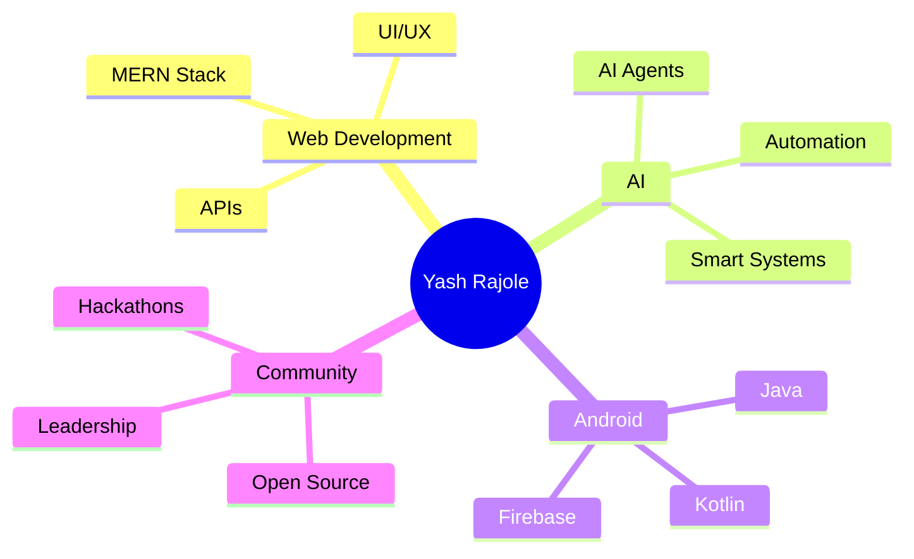

<div align="center">  <br>
  <h1># 🚀 Yash Rajole | Full Stack Developer</h1> <br>
   </a> <br/>


</div>

---

# 💫 About Me


```yaml
Name: Yash Rajole
Education: B.Tech CSE @ Sandip University
Role: Full Stack Developer
Current Focus:
  - AI Agents
  - Android Development
  - MERN Stack
  - Open Source
Club Position: President @ Webmaster Club
Goal: Building impactful tech products 🚀
```

<br/>

* 🌐 Passionate about building modern web experiences
* 🚀 Creator of an Internship Platform for students
* 🧠 Exploring AI-powered applications & automation
* 💡 Interested in Startups, Innovation & Community Building
* 🏆 Active in hackathons & development communities
* 📚 Always learning new technologies and frameworks

---

# 🌍 Portfolio Vision

<div align="center">

| 🚀 Development      | 🤖 AI & Automation | 📱 Android  | 🌐 Open Source          |
| ------------------- | ------------------ | ----------- | ----------------------- |
| Full Stack Projects | AI Agents          | Java/Kotlin | Community Contributions |
| Responsive UI/UX    | Automation Tools   | Mobile Apps | Collaboration           |
| MERN Stack          | Smart Systems      | Firebase    | Learning in Public      |

</div>

---

# ⚡ Tech Arsenal

<div align="center">

## 👨‍💻 Languages


---

## ⚛️ Frameworks & Tools


---

## 🎨 Design & Productivity


</div>

---

# 📌 Featured Projects

<div align="center">

## 🚀 Internship Platform


</div>

### 💡 Features

* Student/Admin Authentication
* Internship Management
* Modern Responsive UI
* Real-time Dashboard
* Career-focused Platform

🔗 **Repository:**
👉 https://github.com/Yashrajol/internship-platform

---

# 📊 GitHub Statistics

<div align="center">


</div>

---

# 📈 Contribution Activity

<div align="center">


</div>

---

# 🏆 Achievements & Trophies

<div align="center">


</div>

---

# 🎯 Current Interests

<div align="center">



</div>

---

# 🌐 Connect With Me

<div align="center">

<a href="https://www.linkedin.com/in/yash-rajole-170784207">

</a>

<a href="mailto:yashrajole25@gmail.com">

</a>

<a href="https://github.com/Yashrajol">

</a>

</div>

---

# ✨ Developer Quote

<div align="center">


</div>

---

<div align="center">

## 💬 “Code. Create. Contribute. Repeat.” 🚀


</div>
